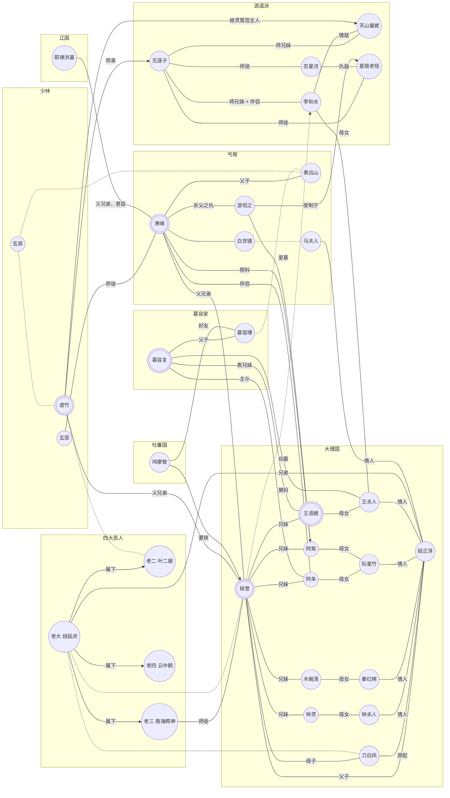

# 天龙八部主要人物、关系

图例：

* 双环圈示重点人物
* 实线表示两个人物的一般关系
* 虚线表示两个人物的“隐藏”关系
* 带箭头的线表示一种单向关系

此外：

* 人物大致按所属或所关联的主要门派、家族归类，但同时也考虑到绘图效果，故此个别人物的归类可能不是特别合适。比如“萧远山”，他是辽国人，不属于丐帮，但考虑到他跟“萧峰”与“丐帮”的重大关联，以及绘图的效果，把他放在了“丐帮”下面，而不是“辽国”；又比如“段正淳”的情人们，如“王夫人”，并非都是大理人或在大理居住，但考虑到他们与大理段氏的关系，都归于“大理国”下。
* 大部分人物之间只标识出了一种主要关系，如“父子”、“师徒”等，没有包括其他的复杂关系（如有）——比如“慕容复”跟“王夫人”之间，不是只有“外甥-舅妈”的关系，更有十分复杂的利害关系。
* 有些人物之间没有标明关系，或是为了减少“剧透”，如“段誉”与“段延庆”的关系，或是因为人物之间的关系比较复杂、无法简单概括，比如“萧峰”与“白世镜”。
* 考虑到绘图效果，个别推动剧情的重要人物并未出现，如少林“扫地僧”，但不影响主要人物关系。

最后，关系图由Mermaid Flow Chart绘制，作者在此表示感谢。但由于该软件本身只是用于绘制流程图而非人物关系图，故此效果欠佳，请读者包涵。如读者知道用于Markdown的更合适的绘图软件，请不吝示之。
