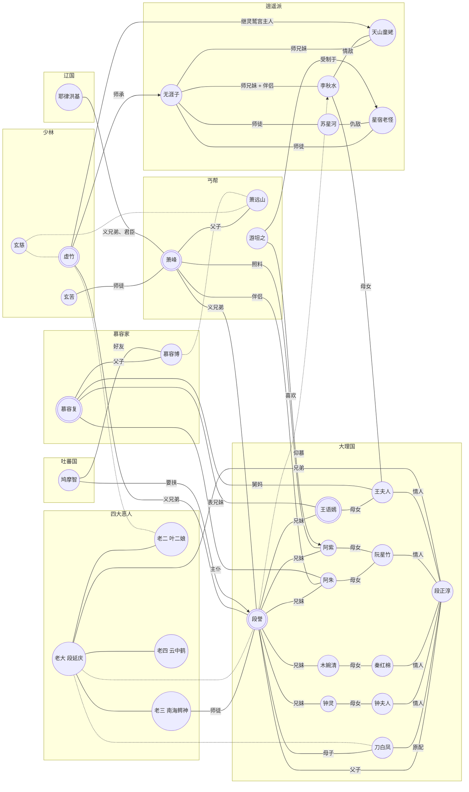

# 天龙八部主要人物、关系

```mermaid
graph LR

subgraph 大理国
direction LR
duanyu(((段誉))) ---|兄妹| zhongling((钟灵))
duanyu ---|兄妹| muwanqing((木婉清))
duanyu ---|兄妹| azhu((阿朱))
duanyu ---|兄妹| azi((阿紫))
duanyu ---|兄妹| wangyuyan(((王语嫣)))
duanyu ----|父子| duanzhengchun((段正淳))
duanyu ----|母子| daobaifeng((刀白凤))
zhongling ---|母女| zhongfuren((钟夫人))
muwanqing ---|母女| qinhongmian((秦红棉))
azhu ---|母女| ruanxingzhu((阮星竹))
azi ---|母女| ruanxingzhu
wangyuyan ---|母女| wangfuren((王夫人))
daobaifeng ---|原配| duanzhengchun
zhongfuren ---|情人| duanzhengchun
qinhongmian ---|情人| duanzhengchun
ruanxingzhu ---|情人| duanzhengchun
wangfuren ---|情人| duanzhengchun
end

subgraph 四大恶人
direction TB
duanyanqing((老大 段延庆)) --- yeerniang((老二 叶二娘))
duanyanqing --- nanhaieshen((老三 南海鳄神))
duanyanqing --- yunzhonghe((老四 云中鹤))
duanyanqing ---|兄弟| duanzhengchun
nanhaieshen ---|师徒| duanyu
duanyanqing -.- daobaifeng
duanyanqing -.- duanyu
end

subgraph 逍遥派
direction LR
wuyazi((无涯子)) ---|师兄妹 + 伴侣| liqiushui((李秋水))
wuyazi ---|师兄妹| tianshantonglao((天山童姥))
wuyazi ----|师徒| suxinghe((苏星河))
wuyazi ----|师徒| xingxiulaoguai((星宿老怪))
suxinghe ---|仇敌| xingxiulaoguai
liqiushui ---|情敌| tianshantonglao
liqiushui ---|母女| wangfuren
duanyu -.->|仰慕| liqiushui
end

subgraph 丐帮
direction LR
xiaofeng(((萧峰))) ---|义兄弟| duanyu
xiaofeng ---|伴侣| azhu
xiaofeng ---|照料| azi
xiaofeng ---|父子| xiaoyuanshan((萧远山))
youtanzhi((游坦之)) -->|喜欢| azi
youtanzhi -->|受制于| xingxiulaoguai
end

subgraph 少林
direction LR
xuzhu(((虚竹))) ---|义兄弟| duanyu
xuzhu -->|师承| wuyazi
xuzhu -->|继灵鹫宫主人| tianshantonglao
xuzhu -.- yeerniang
xuanci((玄慈)) -.- xuzhu
xuanci -.- xiaoyuanshan
xuanku((玄苦)) ---|师徒| xiaofeng
end

subgraph 慕容家
direction LR
murongfu(((慕容复))) ---|表兄妹| wangyuyan
murongfu ---|舅妈| wangfuren
murongfu ---|主仆| azhu
murongfu ---|父子| murongbo((慕容博))
murongbo -.- xiaoyuanshan
end

subgraph 吐蕃国
direction LR
jiumozhi((鸠摩智)) -->|要挟| duanyu
jiumozhi ---|好友| murongbo
end

subgraph 辽国
yelvhongji((耶律洪基)) ---|"义兄弟、君臣"| xiaofeng
end
```
